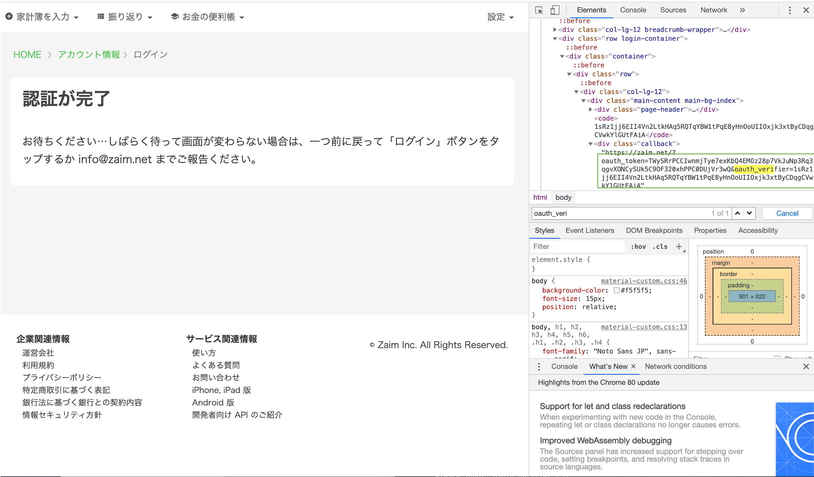

## Usage

1. `cp .env.sample .env`
2. [ここ](https://qiita.com/shutosg/items/6845057432bca551024b)を参考にZaimアプリケーションを作成する
    - サービス種は`クライアントアプリ`にする
    - URLは`https://www.zaim.net`にする
    - アクセスレベルのチェックボックスに全てチェックを入れる
3. `.env`を編集する
    - `CONSUMER_KEY`に 2 で作成したアプリケーションの`コンシューマ ID`を入力する
    - `CONSUMER_SECRET`に 2 で作成したアプリケーションの`コンシューマシークレット`を入力する
4. 以下を実行する 

   ```shell script
   python3 -m venv .venv
   source .venv/bin/activate
   pip install -r requirements.txt
   python3 get_zaim_access_token.py
    ```
   
5. コンソールに出てきたリンクをブラウザで開き，ログインする

    
    
6. 認証が完了したら，ブラウザのデベロッパーツールを開き，`oauth_verifier`をコピーし，コンソールに入力する

    
    
7. Slack内で通知を送りたいチャンネルのURLをリンクをコピーし，`channnel id`を`.env`内の`SLACK_CHANNEL_ID`に書き込む
    - リンクは`https://[channel name].slack.com/archives/[channel id]`という構造になっている
    
    
    
8. [ここ](https://api.slack.com/apps)にアクセスし，Slack App を作成する

    
    
9. リダイレクト先の`basic information`に書かれている`App Credential`を確認し，`.env`内の環境変数を編集

    
    
10. 以下を実行し，最後に出力されるZaimToSlackApiのURLをコピー
    - URLは`https://[ランダムな半角英数].execute-api.ap-northeast-1.amazonaws.com/Prod/moneyinfo`という構造
    - `Deploy this changeset? [y/N]`　は y とする
    - timeout が出るが気にしない

    ```shell script
    ./deploy.sh
    ```
    
11. Slack App内の`Event Subscriptions`を選択し，以下の操作を行う
    - `enable events`を`on`
    - `Request URL`に 10 でコピーしたURLを貼り付け
    - `bot events`に`app:mention`イベントを追加
    
    
    
12. Slack App内の`Settings`の`Install App`を選択し，アプリケーションをSlack内のチャンネルに追加

    

13. リダイレクト先の`Bot User OAuth Access Token`を`.env`内の`SLACK_BOT_USER_ACCESS_TOKEN`に追加し，10を再度実行する 

    

14. `Settings`の`Basic Information`から`Add features and functionality`に存在する`Permissions`を選択し，`chat:write`権限を追加する

    
    
15. slackの画面に戻って`アプリを追加する`から作成したアプリケーションを追加し完成！

    
    
